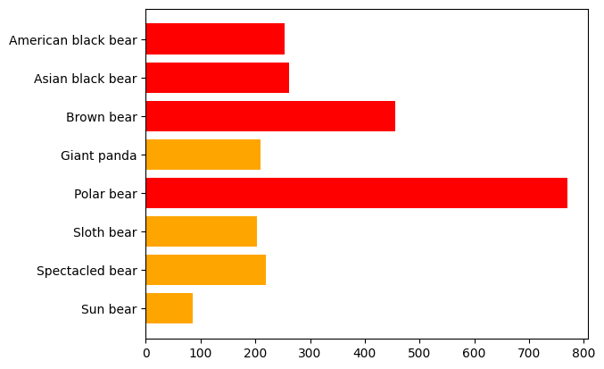

<div align="center">
  
  <br/>
  <div align="center">
    <a href="https://pypi.python.org/pypi/redframes"></a>
    <a href="https://pypi.python.org/pypi/redframes"></a>
    <a href="https://pandas.pydata.org/"></a>  
  </div>
  <br/>
</div>


<b style="color:red;">red</b><b>frames</b> (<b style="color:red;">re</b>ctangular <b style="color:red;">d</b>ata <b>frames</b>) is a data manipulation library for ML and visualization. It is fully interoperable with [pandas](https://github.com/pandas-dev/pandas), compatible with [scikit-learn](https://github.com/scikit-learn/scikit-learn), and works great with [matplotlib](https://github.com/matplotlib/matplotlib)!

<b style="color:red;">red</b><b>frames</b> prioritizes syntax over flexibility and scope. And minimizes the *number-of-googles-per-lines-of-code*™ so that you can focus on the work that matters most.

"What is <b style="color:red;">red</b><b>frames</b>?" would be the answer to the Jeopardy! clue "A [pythonic](https://stackoverflow.com/a/25011492/3731467) [dplyr](https://github.com/tidyverse/dplyr)".


### Install & Import

```sh
pip install redframes
```

```python
import redframes as rf
```


### Quickstart

Copy-and-paste this:

```python
import redframes as rf

df = rf.DataFrame({
    "foo": ["A", "A", "B", None, "B", "A", "A", "C"],
    "bar": [1, 4, 2, -4, 5, 6, 6, -2], 
    "baz": [0.99, None, 0.25, 0.75, 0.66, 0.47, 0.48, None]
})

# | foo   |   bar |    baz |
# |:------|------:|-------:|
# | A     |     1 |   0.99 |
# | A     |     4 |        |
# | B     |     2 |   0.25 |
# |       |    -4 |   0.75 |
# | B     |     5 |   0.66 |
# | A     |     6 |   0.47 |
# | A     |     6 |   0.48 |
# | C     |    -2 |        |

(
    df
    .mutate({"bar100": lambda row: row["bar"] * 100})
    .select(["foo", "baz", "bar100"])
    .filter(lambda row: (row["foo"].isin(["A", "B"])) & (row["bar100"] > 0))
    .denix("baz")
    .group("foo")
    .rollup({
        "bar_mean": ("bar100", rf.stat.mean), 
        "baz_sum": ("baz", rf.stat.sum)
    })
    .gather(["bar_mean", "baz_sum"], into=("variable", "value"))
    .sort("value")
)

# | foo   | variable   |   value |
# |:------|:-----------|--------:|
# | B     | baz_sum    |   0.91  |
# | A     | baz_sum    |   1.94  |
# | B     | bar_mean   | 350     |
# | A     | bar_mean   | 433.333 |
```


### IO

Save, load, and convert `rf.DataFrame` objects:

```python
import redframes as rf
import pandas as pd

df = rf.DataFrame({"foo": [1, 2], "bar": ["A", "B"]})

# save/load
rf.save(df, "example.csv")
df = rf.load("example.csv")

# to/from pandas
pandf = rf.unwrap(df)
reddf = rf.wrap(pandf)
```


### Verbs

There are 24 core "verbs" that make up `rf.DataFrame` objects. Each verb is [pure](https://en.wikipedia.org/wiki/Pure_function), "chain-able", and has an analog in pandas/tidyverse (see *docstrings* for more info/examples): 

|                                                   | pandas                     | tidyverse                          |
| ------------------------------------------------- | -------------------------- | ---------------------------------- |
| `.accumulate`                                     | `cumsum`                   | `mutate(... = cumsum(...))`        |
| `.append`                                         | `concat`                   | `bind_rows`                        |
| `.combine`                                        | `+`                        | `unite`                            |
| `.cross`                                          | `merge(..., how="cross")`  | `full_join(..., by = character())` |
| `.dedupe`                                         | `drop_duplicates`          | `distinct`                         |
| [`.denix`](https://www.dictionary.com/browse/nix) | `dropna`                   | `drop_na`                          |
| `.drop`                                           | `drop(..., axis=1)`        | `select(-...)`                     |
| `.fill`                                           | `fillna`                   | `fill`, `replace_na`               |
| `.filter`                                         | `df[df[col] == condition]` | `filter`                           |
| `.gather`                                         | `melt`                     | `gather`, `pivot_longer`           |
| `.group`                                          | `groupby`                  | `group_by`                         |
| `.join`                                           | `merge`                    | `*_join`                           |
| `.mutate`                                         | `apply`, `astype`          | `mutate`                           |
| `.rank`                                           | `rank("dense")`            | `dense_rank`                       |
| `.rename`                                         | `rename`                   | `rename`                           |
| `.replace`                                        | `replace`                  | `mutate(... = case_when(...))`     |
| `.rollup`                                         | `agg`                      | `summarize`                        |
| `.sample`                                         | `sample(n, frac)`          | `sample_n`, `sample_frac`          |
| `.select`                                         | `select`                   | `select`                           |
| `.shuffle`                                        | `sample(frac=1)`           | `sample_frac(..., 1)`              |
| `.sort`                                           | `sort_values`              | `arrange`                          |
| `.split`                                          | `df[col].str.split()`      | `separate`                         |
| `.spread`                                         | `pivot_table`              | `spread`, `pivot_wider`            |
| `.take`                                           | `head`, `tail`             | `slice_head`, `slice_tail`         |


### Properties

In addition to all of the verbs there are several properties attached to each `DataFrame`:

```python
df["foo"] 
# ['A', 'A', 'B', None, 'B', 'A', 'A', 'C']

df.columns 
# ['foo', 'bar', 'baz']

df.dimensions
# {'rows': 8, 'columns': 3}

df.empty
# False

df.memory
# '686 B'

df.types
# {'foo': object, 'bar': int, 'baz': float}
```


### matplotlib

`rf.DataFrame` objects integrate seamlessly with `matplotlib`:

```python
import redframes as rf
import matplotlib.pyplot as plt

df = rf.DataFrame({
    'position': ['TE', 'K', 'RB', 'WR', 'QB'],
    'avp': [116.98, 131.15, 180, 222.22, 272.91]
})

df = (
    df
    .mutate({"color": lambda row: row["position"] in ["WR", "RB"]})
    .replace({"color": {False: "orange", True: "red"}})
)

plt.barh(df["position"], df["avp"], color=df["color"]);
```




### scikit-learn

`rf.DataFrame` objects are fully compatible with `sklearn` functions, estimators, and transformers:

```python
import redframes as rf
from sklearn.model_selection import train_test_split
from sklearn.linear_model import LinearRegression

df = rf.DataFrame({
    "touchdowns": [15, 19, 5, 7, 9, 10, 12, 22, 16, 10],
    "age": [21, 22, 21, 24, 26, 28, 30, 35, 28, 21],
    "mvp": [1, 1, 0, 0, 0, 0, 0, 1, 0, 0]
})

target = "touchdowns"
y = df[target]
X = df.drop(target)
X_train, X_test, y_train, y_test = train_test_split(X, y, test_size=0.3, random_state=1)

model = LinearRegression()
model.fit(X_train, y_train)
model.score(X_test, y_test)
# 0.5083194901655527

print(X_train.take(1))
# rf.DataFrame({'age': [21], 'mvp': [0]})

X_new = rf.DataFrame({'age': [22], 'mvp': [1]})
model.predict(X_new)
# array([19.])
```
